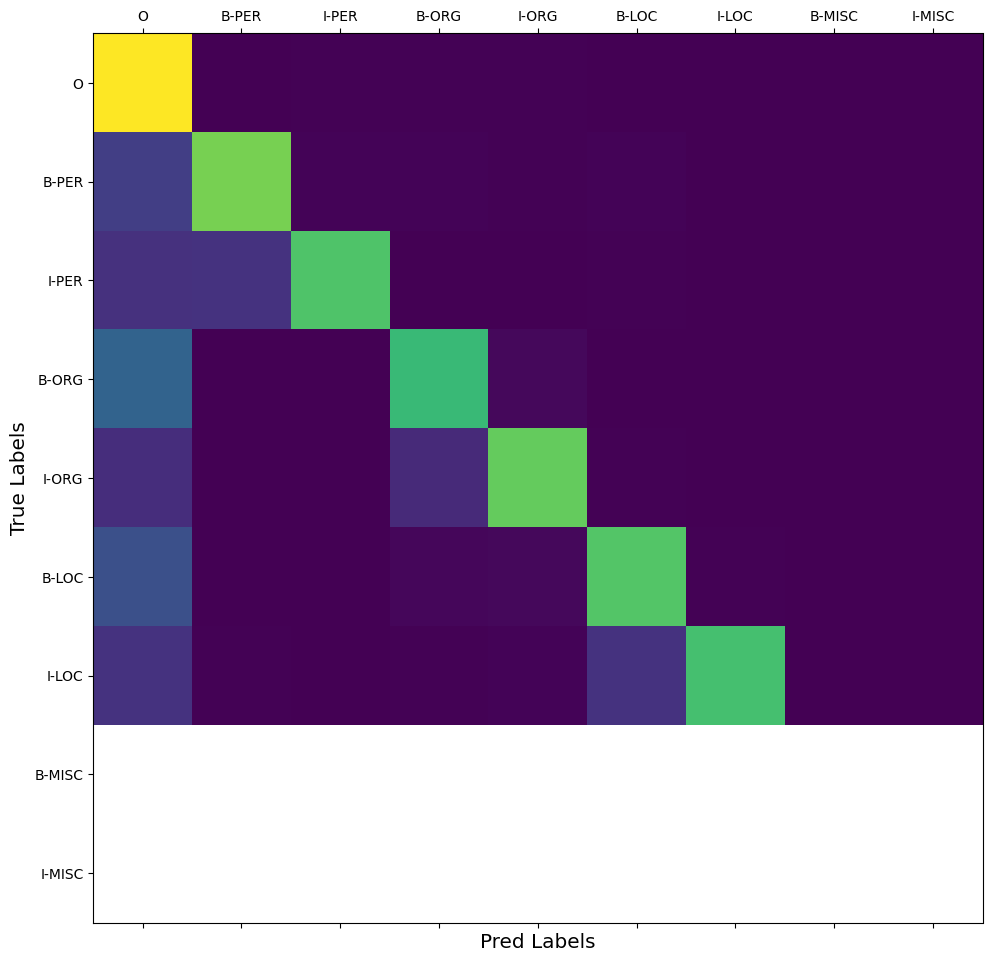

# SF-DS-NLP-Project-4
### by Liliya Kazykhanova
Token Classification (NER)

**Case Description**:
In this notebook we will train a Named Entity Recognition (NER) model using RuBERT.

**Technical Task**
* Using the data to build a model that predicts NER tags.

**Type of ML/DL task**
* Token Classification (NER)

**Data:**
* There are 3 files: *train*, *dev* and *test* txt files with context and tags..

**NOTES**:
* I run it based on Kaggle resources (GPU)

[Link to Project](https://github.com/LiliyaKazykhanova/SF_DS/tree/main/NLP_PROJECTS/PROJECT_4/project/project-4-token-classification.ipynb)

## Content
[Introduction](https://github.com/LiliyaKazykhanova/SF_DS/tree/main/NLP_PROJECTS/PROJECT_4#Introduction)

[Model training](https://github.com/LiliyaKazykhanova/SF_DS/tree/main/NLP_PROJECTS/PROJECT_4#Model-training)

[Results](https://github.com/LiliyaKazykhanova/SF_DS/tree/main/NLP_PROJECTS/PROJECT_4#Results)

[Recommendations](https://github.com/LiliyaKazykhanova/SF_DS/tree/main/NLP_PROJECTS/PROJECT_4#Recommendations)

## INTRODUCTION
There are the next steps before Model building/training:
- Create dataset from giving files (train.txt as train_data, dev.txt as val_data, test.txt as test_data)
    * Getting dictionary with tokens and ner_tags for model training stage
    * Adding values as `input_ids`, `attention_mask` and `labels` to our dataset examples.
- Use DataCollatorForTokenClassification() to create a batch of examples

## **MODEL TRAINING**
- Transfer-learning RuBERT on our classes - 9:
    * **O** means the word doesn’t correspond to any entity.
    * **B-PER/I-PER** means the word corresponds to the beginning of/is inside a person entity.
    * **B-ORG/I-ORG** means the word corresponds to the beginning of/is inside an organization entity.
    * **B-LOC/I-LOC** means the word corresponds to the beginning of/is inside a location entity.
    * **B-MISC/I-MISC** means the word corresponds to the beginning of/is inside a miscellaneous entity.

- Parameters:
    * **number of epochs** - 10
    * **batch size** - 16
    * **optimizer** - AdamW()
    * **learning_rate** - 1e-5

## **RESULTS**
- Trainig Loss plot
- Validation Loss plot
- Validation Loss confusion matrix

### **Visualize the Training Loss**

* The training loss is rapidly decreasing to eopch 2. After there is plateau case.

### **Visualize the Validation Loss**

* The validation loss gets higher than training loss but here also there is a tendency to decreasing of value epoch by epoch. As you can see there is not any plateau case. It means that we can to increase epoch number for training.

### **Visualize the Confusion matrix**

`The successful predictions of the classifier, the ones where the predicted class matches the true class are along the diagonal of the confusion matrix`

Based on the confusion matrix for each tag we can conclude that:
* Tokens with similar meanings are predicted by the model with similar tag pair (B-PER/I-PER, B-ORG/I-ORG, B-LOC/I-LOC) or tag O (means the word doesn’t correspond to any entity).

## **MODEL TRAINING with Trainer()**
- RuBERT model
- Training hypermarameters
    * **batch size** - 16
    * **number of epochs** - 5
    * **learning_rate** - 1e-5
    * **weight decay** (regularization technique) - 0.01
    <!-- * **warmup** (learning rate schedule) - 0.1 -->
## **RESULTS**
* f1 on test dataset - 0.974 (vs on train 0.975)

* Altough score value is high there is missmatches in real and predicted tags:

| real tag | pred tag | token | score |
| :-: | :-: | :-: | :-: |
| I-ORG | O | O при прокуратуре Российской Федерации по Якутии возбудило уголовное | 0.91 |
| I-ORG | O | O прокуратуре Российской Федерации по Якутии возбудило уголовное дело | 0.84 |
| B-ORG | I-ORG | СНГ и связям с соотечественниками Дмитрий Саблин | 0.78 |
|  |  |  | |

* At the same time the model also suggested better tag, for example in the next case:
    - Here 'ВКонтакте' token is look like more B-/I-ORG as predicted by the model than O (real tag).
    
| real tag | pred tag | token | score |
| :-: | :-: | :-: | :-: |
| O | B-ORG | ВКонтакте даже проводится опрос с перечнем кандидатур | 1.0 |
|  |  |  | |

## **RECOMMENDATIONS**
**How to solve these missmatches?**
* Increasing epoch number
* Use more precisely labeled data